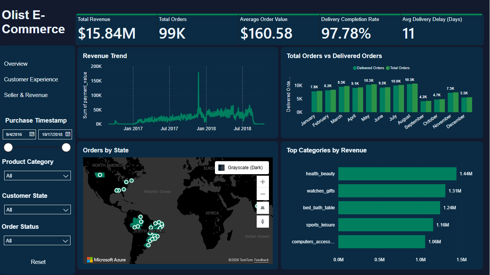
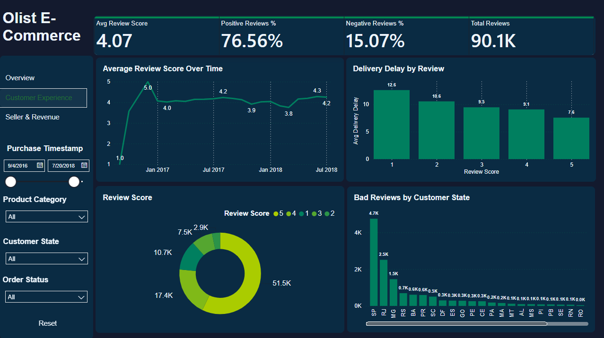
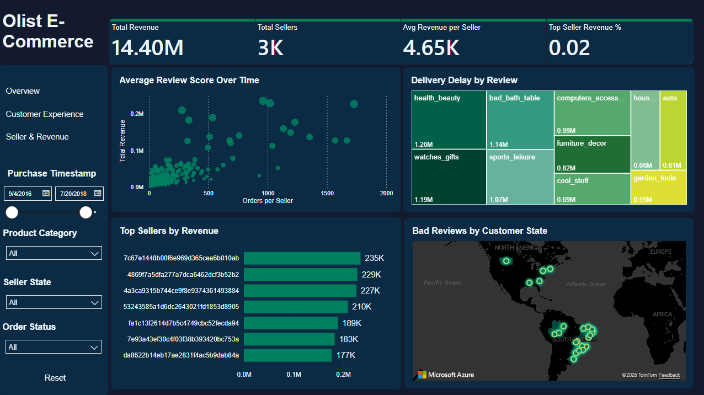

# Olist E-Commerce Sales Analysis | Power BI

This project is an end-to-end **Business Intelligence analysis** built using the **Brazilian E-Commerce Public Dataset (Olist)**.  
The goal is to transform raw transactional data into **clear, actionable insights** using Power BI.

The project covers the full workflow:
- Data understanding
- Data cleaning and preparation
- Data modeling & relationships
- DAX measures
- Interactive dashboard design

---

## 📊 Project Overview

The dashboard answers key business questions such as:
- How is revenue evolving over time?
- Which sellers and product categories generate the most revenue?
- What is the order lifecycle performance (purchase → delivery)?
- How do customers and sellers contribute to overall sales?

The report is designed with **realistic business use cases**, not just visuals.

---

## 🛠 Tools & Technologies

- **Power BI (2026)**
- **Python (Pandas, NumPy)** – data cleaning & preprocessing
- **Jupyter Notebook**
- **CSV datasets**
- **DAX** – calculated measures and KPIs

---

## 🧹 Data Preparation

- Handled missing values based on business logic (not blind deletion)
- Cleaned and standardized date fields
- Optimized tables for Power BI relationships
- Exported clean CSVs for modeling inside Power BI

---

## 📈 Dashboard Pages

### 1️⃣ Overview Page
High-level KPIs and overall business performance.

---

### 2️⃣ Orders & Customers Page
Order lifecycle analysis, customer behavior, and delivery performance.

---

### 3️⃣ Sellers & Revenue Page
Seller performance, revenue contribution, and category insights.

---

## 📂 Repository Structure

